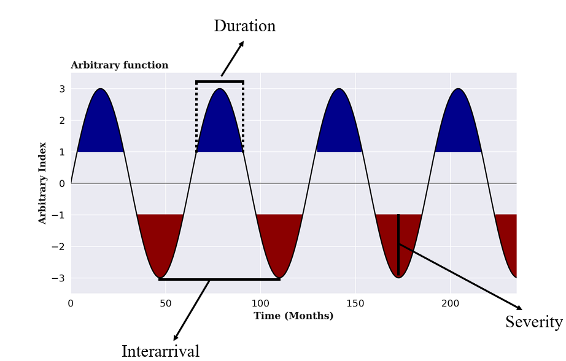
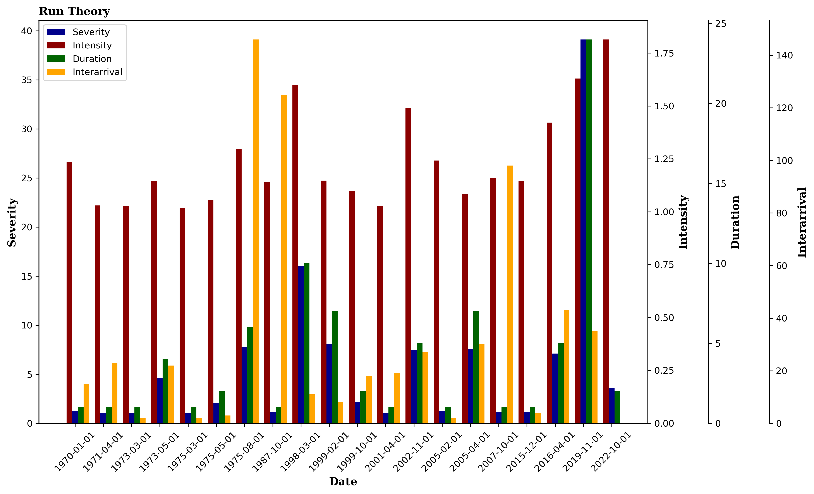

# Drought Identification (Run-Theory)
Drought is a complex and cumulative phenomenon that threatens local water availability [(Amin Zargar et al., 2011)](https://cdnsciencepub.com/doi/10.1139/a11-013).
Drought can have meteorological, agricultural, and hydrological impacts [(Liu, C et al., 2021)](https://www.nature.com/articles/s41598-020-80527-3). The drought can be identification for *Standardized Precipitation Index* (SPI) and *Standardized Precipitation and Evapotranspiration Index* (SPEI).

## Run Theory
Run Theory is used for event classifications and can be employed to obtain the characteristics of drought phenomena [(V. Yevjevich, 1969)](https://api.mountainscholar.org/server/api/core/bitstreams/5f26da05-d712-49bc-acc0-397ec0f70fef/content). Drought events are characterized by severity, duration, intensity, and the interval between events. In Figure (1), we can visually identify some of these characteristics, where intensity is the ratio of severity to duration, as shown in Equation 1.

$$intensity = \frac{severity}{duration} \ \ \ \ \ \ \ \  \  \ \ \ \ \ \ \ \ \ \ \ \ \ \ \ \  (1)$$ 

In Figure (1), we have duration, severity, and the interval between events.

  

*Figure 1. Characteristics of drought events through a function of an arbitrary index*

## Drought characteristics
The SPI was calculated using the gamma function method [(James Adams, 2017)](https://github.com/monocongo/climate_indices), and then severity, duration, and intensity values were obtained through Run-Theory, as shown in Figure (2).

  

*Figure 2. Characteristics of drought events obtained from SPI*

# References

Amin Zargar, Rehan Sadiq, Bahman Naser, Faisal I. Khan, 2011. A review of drought indices. Environmental reviews 19, 333–349. https://doi.org/10.1139/a11-013

Adams, J., 2017. climate_indices, an open source Python library providing reference implementations of commonly used climate indices, URL: https://github.com/monocongo/climate_indices.

Liu, C, Yang, C, Yang, Q, 2021. Spatiotemporal drought analysis by the standardized precipitation index (SPI) and standardized precipitation evapotranspiration index (SPEI) in Sichuan Province, China | Scientific Reports [WWW Document]. URL https://www.nature.com/articles/s41598-020-80527-3 (accessed 9.2.22).

V. Yevjevich, 1969. An objective approach to definitions and investigations of continental hydrologic droughts. VUJICA YEVJEVICH: Fort Collins, Colorado State University, 1967, 19 p. (Hydrology paper no. 23). Journal of Hydrology 7, 353–353. https://doi.org/10.1016/0022-1694(69)90110-3

